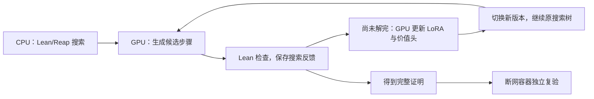

# Reap V1：真实 GPU TTT 的结果与复现

**题内 TTT 已跑通。重点结果：第 1 题在同一次证明搜索中完成 3 次真实 GPU 更新，搜索依次使用更新后的 v1、v2、v3，最终证明成功。生成的证明已在断网 CPU 容器中独立检查通过。**

TTT 是“测试时训练”：模型一边解当前题目，一边利用搜索反馈调整参数，再用调整后的模型继续解题。本包保存实际运行的代码、题目、证明、检查记录，以及别人从这个包开始复现所需的步骤。

## 实际跑通的流程

1. **CPU 搜索。** 预编译 Lean 加上 Reap/MCTS 维护证明搜索树；GPU 上的 REAL-Prover 7B 提供候选证明步骤。
2. **Lean 检查。** 执行候选，记录哪些步骤有效、访问次数和搜索回传值。
3. **GPU 学习。** 在题目尚未解决时，用这些记录更新该题的 LoRA（少量可训练参数）和价值头（估计当前证明状态的前景）；7B 基座冻结。
4. **继续原搜索。** 更新完成后切换版本，继续同一棵树。第 1 题经历 v0→v1→v2→v3，每个新版本都有实际后续调用。
5. **独立验收。** 保存最终证明，交给断网容器中的 Lean 重验；再核对搜索记录、远端请求和模型快照，确认更新实际发生且用于后续搜索。

重点过程与原文逐项对照见 [10-原设计逐项对照与实际流程](docs/10-原设计逐项对照与实际流程.md)。

## 五道题的结果

| 题目 | 完成的更新次数 | 最终结果 | 搜索协调执行窗口 |
|---|---:|---|---:|
| **1：奇数与平方的耦合递推** | **3** | **证明成功，独立复验通过** | **123.062 秒** |
| 2：线性递推累积关系 | 5 | 达到 32 步搜索上限，未证明 | 400.088 秒 |
| 3：带系数的三角数递推 | 1 | 证明成功，独立复验通过 | 94.329 秒 |
| 4：递推差值不变量 | 0 | 达到 32 步搜索上限，未证明 | 344.288 秒 |
| **5：立方累积递推** | **2** | **证明成功，独立复验通过** | **55.206 秒** |

共尝试 **5 道不同题、8 个 session**，其中包括通信失败后的同题重试。上表第 1、5 题采用成功重试的成绩；初次失败及额外等待没有删除，详见 [09-五题尝试与并发结果](docs/09-五题尝试与并发结果.md)。时间不包含创建 session、前后快照、下载、准备环境和独立复核；从零部署的总耗时另计。TTT 没有五分钟硬性时限。

历史 E（1 次更新后证明成功）和 F（5 次更新但未证明）也保留，见 [03](docs/03-实际TTT结果与证据.md) 与 [07](docs/07-多轮TTT记录与成功边界.md)。

## 已跑通的核心流程

**已实测：真实 Lean 搜索反馈 → GPU 更新策略与价值头 → 新版本继续原树 → 最终 Lean 证明。** 第 1、5 题还核对了实际训练前后快照及全部更新回执，满足同题多轮 TTT 的验收要求。

## 尚未完成的工作

- **跨题经验继承：** 新题仍独立初始化，上一题的学习结果尚未传递给下一题。
- **GPU 容器与发布：** CPU 容器已验收；GPU 目前在远端宿主环境运行，B 容器的构建、运行验收和镜像发布尚待完成。
- **稳定的多题并发：** 首次五路运行有通信失败，后续同题重试成功；仍需改善浏览器链路并补测稳定并发运行。
- **训练效果评估：** 尚未做不训练的对照实验，下一步需比较训练对成功率、耗时和搜索量的影响。

**容器失败原因：** 远端曾出现只读内核配置、`proc` 挂载被拒绝，后续实例也未发现可用Docker服务；本地CPU镜像已成功。详情见 [06-容器失败与部署办法](docs/06-容器未完成原因与交付边界.md)。

更完整的设计对应关系与后续工作见 [10](docs/10-原设计逐项对照与实际流程.md)。

## 各子文件夹用在哪里

| 文件夹 | 内容与用途 |
|---|---|
| [docs/](docs/README.md) | 读流程和结果；09 是本轮五题成绩，10 对照原设计，02/04 用于复现，05 比较新 Docker 参考材料 |
| [source/](source/README.md) | 校验并解出 CPU/GPU 源码；`transport-fix/` 是新运行需覆盖的宿主桥补丁；不含模型权重 |
| [docker/](docker/README.md) | 构建与启动 CPU/GPU 两份镜像的材料；解释构建、运行和发布各需什么条件 |
| [evidence/](evidence/README.md) | 复核证明、实际更新和版本使用；`multiround/` 是本轮五题证据，根目录 E/F 文件是历史证据 |

**展示时按“本页结论与流程图 → [10 三轮过程与设计对照](docs/10-原设计逐项对照与实际流程.md) → [09 完整五题结果](docs/09-五题尝试与并发结果.md)”阅读。** 要让新 agent 复现，交给它整个本包与 [04-新agent复现prompt](docs/04-新agent复现prompt.md)，无需原项目的其他文件。

`package-manifest.json` 给出包内文件的大小和 SHA256。包内不放 7B 权重、镜像二进制、账号信息或无关临时文件。本包按用户授权上传至 [reap-new-update-model/v1-result](https://github.com/wufuju2023-cell/reap-new-update-model/tree/master/v1-result)，作为报告与复现材料交付；GPU镜像发布另行处理。实例由用户启停；远端实验和取证已经结束，后续本地阅读与整理无需 GPU。
