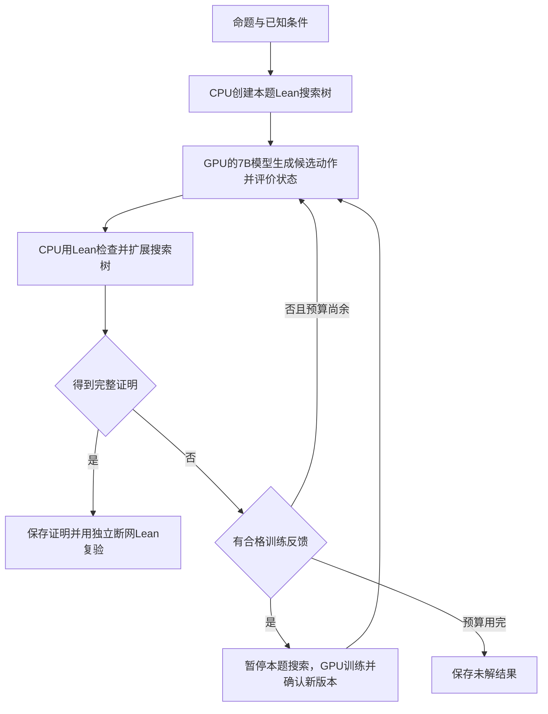

# 整体流程与CPU、GPU分工

## 从数学命题开始

输入是一条Lean形式的数学命题，包括变量、已知条件和需要证明的结论。例如：一个数列从1开始，每次加2；另一个从0开始，依次累加前一个数列。要求证明它们的第n项分别为`2n+1`和`n²`。输入没有提供答案。

Lean记录当前证明状态，其中包含可用条件和尚未解决的目标。7B模型读取这一状态，提出若干下一步证明动作，例如引入变量、归纳、使用已有定理或计算。Lean尝试执行这些动作，错误的动作不能成为有效证明。

一个动作可能产生多个子目标，所有必要子目标都完成后才得到整题证明。Reap负责把这些尝试组织为搜索树，选择继续探索的方向。本项目的TTT框架负责让搜索反馈进入训练、确认模型更新并管理多题状态。

## CPU与GPU的分工

| CPU侧 | GPU侧 |
|---|---|
| 保存命题、Lean状态和每题搜索树 | 加载固定版本的7B基础模型 |
| 调用Lean检查候选动作 | 根据证明状态生成候选动作 |
| 记录搜索访问次数和回传估值 | 通过价值网络计算状态估值 |
| 组织训练材料，等待更新确认 | 训练本题附加参数及价值网络 |
| 分配任务、收集结果、独立复验证明 | 保存参数版本、经验与完整模型训练状态 |

CPU容器不需要加载7B权重。模型服务每次收到的是当前证明状态及明确的任务身份；CPU与GPU通过服务请求交换数据。题目、版本和参数来源用于避免不同题的状态混用。

## 流程一：同一题边搜索边学习

循环中保留同一个Lean进程和同一棵搜索树。更新后的模型用于后续生成和估值；已经探索过的记录继续保留。一次训练不会自动解决命题，搜索需要继续执行。

同一题的模型更新有先后顺序：先完成这一轮更新并确认版本，再让后续搜索使用它。其他独立题可以同时在CPU上搜索；它们各有自己的模型状态。

原实验中，奇数累加题在搜索第8步、第9步、第10步分别训练一次，第11步使用第三次更新后的模型完成证明。详见[实际例子](../../docs/current/04-实际实例与验收结果.md#same-tree-three-updates)；操作见[单题复现](../../reproduction/01-单题TTT.md)。

## 流程二：用已验证证明集中学习

这里每次搜索期间模型固定。训练发生在集中训练程序中，只有通过独立检查的成功证明步骤进入该路线的数据。新版本发布后，后面开始的题可以选它；已经在搜索的题保留原版本。

CPU独立检查已保存的证明时，可以让GPU处理下一题。训练、搜索、验证之间有明确的数据交接，不要求所有题同时结束。

两条路线使用各自的价值目标及参数兼容条件。先掌握[训练信号](02-策略价值与训练信号.md)，再阅读[跨题与并发](03-跨题经验版本与并发.md)。

## 完整证明与保存状态

搜索程序报告找到证明后，还要导出证明文件，在另一个断网Lean环境中重新编译，并检查公理依赖。此步骤确认保存的完整证明可以独立成立。

模型检查点保存参数、优化器和随机状态，支持继续训练。当前尚未实现任意中断后重建原来的活跃Lean搜索树，因此复现时保留原进程和输出，失联先查原结果。可复用的参数经验只用于新题初始化，与完整检查点用途不同。
