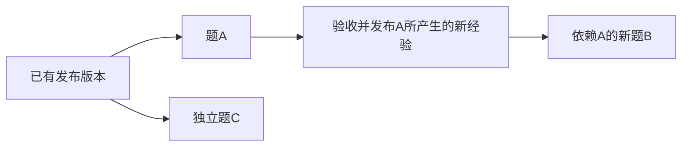

# 跨题经验、模型版本与并发

一道题训练后产生的参数，可以成为下一道题的起点。系统需要同时做到两件事：把已经学到的内容传下去，让每道正在搜索的题保持自己的状态。当前实现用不可改写的参数版本连接不同任务，并为每个新任务建立独立状态。

## 1. 新题继承的内容

本项目的7B基座模型在实验中保持冻结。可训练部分包括LoRA适配器和价值头：LoRA用较小的附加矩阵改变模型生成证明步骤的分布；价值头根据当前证明状态给出搜索所需的估计。

| 内容 | 新题从经验开始 | 完整恢复原任务 |
|---|---|---|
| 冻结基座 | 使用兼容的同一基座 | 使用原基座 |
| LoRA适配器、价值头 | 复制获准来源中的参数 | 恢复保存时的参数 |
| 优化器 | 新建，不继承前题的更新进度 | 恢复原优化器状态 |
| 随机数状态 | 按新会话独立初始化 | 恢复原随机状态 |
| 训练缓冲区、操作记录 | 新建，保留来源信息 | 恢复原任务记录 |
| 题内模型版本 | 从0开始，来源版本另记 | 恢复保存时的题内版本 |
| Lean搜索树 | 为新题建立新树 | 模型快照不等于活跃Lean树的完整恢复 |

例如，题A完成了3次更新。题B继承A发布的参数后，B的题内版本仍是0，来源记录指向A的产物。随后B的第一次更新变成B自己的版本1，不会改动A或正在运行的题C。

完整检查点用于继续原任务，包含参数、优化器和随机数等状态。跨题参数版本用于开始新任务，只传递获准参数及来源。这两种用途对应不同接口和身份检查。

## 2. 两条参数发布路线

### 题内TTT后的经验发布

题目搜索期间可以用真实搜索反馈更新本题参数。来源完成规定的验收后，将其快照中的获准参数发布成不可变经验。下一题显式引用这个经验，复制参数后独立搜索和训练。

经验来源可以明确指定，也可以从操作者批准的集合中按固定规则选择。当前的题族、标签和优先级由操作者提供；系统尚未实现数学语义相似检索。

### 中央学习器发布模型版本

另一条路线让搜索会话在整个尝试中固定模型版本，中央学习器汇总已独立验证的证明步骤并训练。每次训练先提交完整检查点，再发布参数；新尝试可以选择最新已确认版本，已有尝试继续原版。

题内经验记录的是某个会话及其来源快照；中央发布版本记录的是学习任务、训练步和检查点。两种标识不能互相填写。中央版本发布成功，只说明训练产物可供使用，证明是否成立仍由Lean独立验证。

混合学习每批使用9条模型生成并验证的证明步骤，加1条数学库原有证明步骤。比例按步骤数计算，同一份证明可以提供多条步骤。数学库来源有固定提交和原文字节记录，采集脚本不改变这些证明的来源。

## 3. 参数兼容包含价值含义

参数形状相同，还不足以保证可以继承。系统同时核对基座、训练目标、价值含义、适配器配置、张量形状及数据类型等信息。

| 运行路线 | 策略训练来源 | 价值目标 |
|---|---|---|
| 题内搜索训练，代码名`real-search` | 当前搜索候选的访问分布 | 搜索备份值经过约定转换后的折扣标量 |
| 成功证明混合训练，代码名`mixed-replay` | 独立验证过的模型生成步骤与数学库原有步骤 | 已验证证明还需多少步的类别 |

两条路线的价值头和目标不同，不能把`real-search`经验直接填入`mixed-replay`发布接口。折扣系数、价值类别范围或目标合同不匹配时，应使用对应路线的来源或重新建立兼容版本，不能删除检查强行加载。

可执行步骤分别见[跨题经验复用](../../reproduction/02-跨题经验复用.md)和[固定版本多题并发](../../reproduction/03-多题并发.md)。前者沿题内训练路线继承经验；后者先取得兼容的混合训练发布版本，再供两个搜索服务使用。

## 4. 任务依赖与等待顺序

如果明确要求“题B使用题A刚学到的经验”，就建立A到B的依赖。A的经验验收并发布后，B才能引用它开始。其他不依赖A的题仍可运行。

若使用中央学习路线，依赖中还包含独立证明验证和中央训练：先验证A的证明，将步骤纳入训练，再发布B要使用的版本。仅仅看到A搜索结束，不足以启动要求继承新经验的B。

同一目标的多个变体也按这条规则处理：没有明确依赖时可以各自固定起始版本并行；要求后一个使用前一个的新经验时，只等待这条依赖。当前目标变体生成课程仍暂停，这里说明调度规则，不表示已经完成了变体课程实验。

## 5. 一个服务与两个服务的区别

单个服务可以管理多道题的独立会话，CPU也可以同时运行多棵Lean搜索树。但该服务进程在切换适配器、随机状态以及执行推理或训练时，需要顺序访问共享模型。直接去掉锁，会造成不同题的状态混用。

两个服务各自加载完整的7B模型，拥有独立的Python进程、模型对象和会话状态，因此可以同时处理不同题。每个服务内部仍保留顺序执行。这种方式增加显存、主机内存及加载开销，副本数量不能只凭显存容量决定。

当前双服务采集流程在题目开始前固定服务与参数版本，保存分配记录；搜索结束、结果保存且释放回执确认后，才把该服务的容量交给下一题。完整证明验证使用已保存的材料，可以移交CPU处理，无需继续占用原GPU会话。搜索、验证和等待队列都有容量上限。

## 6. 未知结果的处理

请求没有收到响应时，远端可能已经执行。训练、发布或释放的结果未知，就保存原请求身份并暂停相关新操作，先查明原结果，不重复提交同一次训练，也不把题目转到另一个服务重试。

训练已经提交而发布失败时，保留检查点并核对原发布结果；完整恢复要沿原任务记录继续。已知搜索预算耗尽则可以如实保存未解结果，释放会话后继续其他题。失败、未解和未知结果各有不同处理，均保留原始记录。

## 7. 当前证据覆盖的范围

- 真实三题实验验证了同一经验参数传入新题，随后三题各自更新并通过独立Lean检查。
- 同卡两个独立7B服务已经接入真实双题Lean搜索，两题通过证明验证，搜索事件时间区间有重叠。
- 自动发布与两个服务联合运行曾因子服务等待超时而整体失败。后来用新进程完整恢复旧会话、使用已确认的新版本推理通过，恢复没有新增训练或发布；原失败保持不变。

这些结果分别验证继承、固定版本并行以及故障后的恢复。长期稳定运行、完整最新版本多题批次、任意活跃Lean树的无损恢复仍有待验收。新电脑需要自行准备兼容环境、模型和参数仓库，历史哈希只用于对照，不能代替实际文件。

具体材料见[实际实例](../../docs/current/04-实际实例与验收结果.md)、[并发与同步设计](../../docs/current/03-并发调度与模型同步.md)及[AlphaProof、Reap原文和参考Docker的逐项对照](../../docs/current/05-原文与Docker逐项对照.md)。执行时从[环境与代码准备](../../reproduction/00-环境与代码.md)开始，使用自己的新目录与来源版本。
