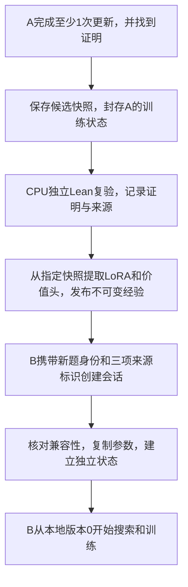

# 跨题经验的设计与代码实现

本章沿当前交付源码，说明题A学到的参数如何成为题B的起点，以及题B继续训练时如何保持A和其他题的状态独立。这里讨论题内搜索训练模式`real-search`。可执行命令见[跨题经验复用教程](../../reproduction/02-跨题经验复用.md)，代码入口均链接到本包的`reproduction/code/src/`，不依赖旧电脑或旧GPU目录。

## 1. 经验由参数和可核查的来源组成

7B基础模型保持冻结，每个会话有自己的LoRA适配器和价值头。LoRA通过小型附加矩阵改变模型生成证明步骤的分布；价值头是评价当前证明状态的小网络。跨题继承复制这两组可训练参数，让新题从已经学习过的状态开始。

经验同时保存来源题、来源会话、来源版本、快照和验收记录。参数内容与来源都需要固定，才能回答“B到底继承了A的哪一次训练结果”。本实现不会将上一题的整个工作状态搬到下一题，也不会自动把任意会话的最新参数覆盖给全部题目。

| 内容 | A发布经验后，B如何处理 |
|---|---|
| 7B基础模型 | 使用合同兼容的冻结基座，不放进经验载荷 |
| LoRA适配器 | 从经验复制到B自己的适配器 |
| 价值头 | 从经验复制到B自己的价值网络 |
| 优化器 | 为B新建AdamW，初始动量等状态为空，更新计数为0 |
| 随机数状态 | 按B的会话ID独立初始化，不复制A的随机流 |
| 训练缓冲区、事件收据 | B从空记录开始 |
| 题内版本 | B从`policy_version=0`开始，A的来源版本另记 |
| Lean搜索树 | B建立自己的树，不继承A的节点、访问次数或证明上下文 |

这里的“经验”是参数经验。自然语言总结、语义相似题检索和文本记忆是另外的功能，当前尚未完成。

## 2. 从A的训练结果到B的初始化



这一流程有三个不同的确认点。

第一，A确实训练过。CPU协调器[`run_online()`](../../reproduction/code/src/cpu_runtime/online_ttt.py)只有在本次没有错误、搜索已经解出、存在成功训练收据，并且显式启用`experience_candidate`时，才请求候选快照。未经更新就解出的题可以保留证明，但不满足本流程的经验来源条件。

第二，封存候选状态。[`GpuRuntime.snapshot(..., for_experience=True)`](../../reproduction/code/src/gpu_runtime/runtime.py)要求来源是题目会话、有题目身份、`policy_version >= 1`且没有待处理训练事件。它把`completed=True`和完整后端状态写入新快照；写入成功后才将驻留会话标为已完成。之后该来源会话的`learn()`和`restore()`会拒绝继续修改训练状态。

第三，独立验证证明并批准发布。GPU快照接口不运行Lean，`completed=True`只是封存状态，不能单独证明数学结论。独立CPU验证必须检查实际证明文件、退出码与公理依赖，再将验收记录绑定到这份候选快照。只有这一步通过，才能发布供下一题使用的经验。

## 3. 来源身份和三个固定值

题目身份与运行身份承担不同工作。

| 字段 | 含义与检查 |
|---|---|
| `session_id` | 一次运行的身份。A和B必须不同；重试也不能冒用原会话身份 |
| `theorem_id` | 题目身份。当前在线入口用完整Lean输入文件的SHA256；B必须与来源题不同 |
| `source.policy_version` | A被封存时的版本，必须大于0 |
| `source.snapshot` | A候选快照的名称，如`experience-candidate` |
| `source.parent_experience_id` | A自身继承过的经验ID；从基础模型开始时为`null` |
| `lineage` | B的来源记录：经验ID、参数哈希、完整来源描述及哪些状态重新初始化 |

当前`theorem_id`绑定的是输入文件字节。它能发现文件不同或相同，不会判断两个不同写法的命题在数学上是否等价，也不构成题目相似度判断。

B的可复现初始化同时固定下面三项：

其中SHA256是内容指纹，用来核对复制前后的文件或参数对象是否一致。

| 创建B时的字段 | 精确来源 | 防止的混淆 |
|---|---|---|
| `experience_id` | 发布时分配的经验名称 | 选错经验条目 |
| `experience_weights_sha256` | 发布回执的`weights_sha256` | 同名经验的参数内容被替换 |
| `experience_snapshot_sha256` | 发布回执中`source.snapshot_sha256` | 来源快照与预期版本不一致 |

参数哈希按[`snapshot_store._json_bytes()`](../../reproduction/code/src/gpu_runtime/snapshot_store.py)的有限JSON格式计算：键排序、固定分隔符、UTF-8、末尾换行。计算对象是包含合同、编码方式和序列化参数的完整`weights`对象，不是某一个LoRA张量。快照哈希则是来源快照`manifest.json`的原始文件SHA256；该清单继续绑定`session.json`和`backend.json`的长度及哈希。

底层接口仍兼容只给`experience_id`的旧调用。如果给了两个内容哈希中的任意一个，就必须同时给另一个。复现教程选择同时固定三项，不靠经验名称单独锁定来源。不要自行增加一个“经验总SHA”来替代这三个实际字段。

## 4. 发布接口只读取指定快照

[`GpuRuntime.publish_experience(session_id, name, experience_id, acceptance)`](../../reproduction/code/src/gpu_runtime/runtime.py)按以下顺序执行：

1. 从指定来源会话和快照名称读取文件，检查完整性。
2. 检查来源已经封存、有题目身份、有至少一次更新、没有待处理训练事件。
3. 根据实际快照构造`source`，包含来源会话、题目、版本、快照哈希和父经验ID。
4. 调用后端`experience_weights()`，从快照中只提取`adapter`与`value_head`。
5. 调用[`ExperienceStore.publish()`](../../reproduction/code/src/gpu_runtime/experience_store.py)写入新经验。

`acceptance`至少需要满足这些明确条件：其`source`与实际来源描述完全一致，`completed`和`passed`都为`true`，有验收证据SHA256。真实模型要求`kind="independent-lean"`；`local-mechanism`只允许用于toy机制测试。

**验收记录来自可信的外部验证流程。** `ExperienceStore`检查记录是否绑定正确来源，但不会根据`evidence_sha256`自行寻找证明文件或重新运行Lean。调用者必须先完成实际验证，不能手写一个成功布尔值冒充证明。哈希用于核查内容，没有提供对恶意仓库拥有者的身份认证。

发布从保存的快照提取参数，不从仍在运行的其他题或某个“当前适配器”取值。原完整快照里的优化器、随机状态和训练计数不进入经验参数载荷。保存源快照后，发布本身也不要求原会话继续占用GPU；教学复现会暂时保留A，便于直接检查B没有影响它。

## 5. 磁盘目录与文件内容

显式配置`--snapshot-root`和`--experience-root`时，目录结构如下。这里的A和经验名称仅是结构示例，应使用本次实际标识。

```text
快照根目录/
  A的session_id/
    experience-candidate/
      manifest.json       完整快照两份文件的长度和哈希
      session.json        A的题目、版本、完成状态、来源、事件记录
      backend.json        A的参数、优化器、随机数等完整后端状态

经验根目录/
  experience_id/
    release/
      manifest.json       本经验两份文件的长度和哈希
      session.json        经验元数据、source、acceptance、weights_sha256
      backend.json        contract、encoding、payload；载荷内只有LoRA与价值头
```

经验仓库复用了`SnapshotStore`的文件容器，因此其中的`session.json`保存的是经验元数据，不是一个可直接恢复的题目会话。默认未指定经验根目录时，运行时使用快照根目录下的`_experiences`。

[`SnapshotStore.create()`](../../reproduction/code/src/gpu_runtime/snapshot_store.py)先写临时目录及校验清单，再发布完整目录；已有同名目标会被拒绝。`load()`检查文件身份、长度与哈希。使用时保持单一运行时或可信操作者管理仓库，不让外部进程改写已经发布的文件；不可变约定不是任意外部并发写入下的安全存储证明。

复制经验到另一台GPU机器时，需要复制完整的`experience_id/release/`目录并复核三项固定值，还需准备合同兼容的基础模型。仅复制经验ID或一个JSON回执不会带来实际参数。来源完整快照和独立证明证据应另外保留，供审计与恢复使用。

## 6. 创建B的实际代码路径

HTTP入口为`POST /sessions/B的session_id`，请求包含B的`theorem_id`以及三项来源字段。[`server.py`](../../reproduction/code/src/gpu_runtime/server.py)将这些字段交给`GpuRuntime.create_session()`。

下面是代码关系示意，`runtime`、验收记录和哈希均须来自实际运行；它不代替复现教程中的单次提交与证据保存程序。

```python
release = runtime.publish_experience(
    source_session_id, "experience-candidate", new_experience_id, acceptance
)
created = runtime.create_session(
    target_session_id,
    theorem_id=target_theorem_sha256,
    experience_id=release["experience_id"],
    experience_weights_sha256=release["weights_sha256"],
    experience_snapshot_sha256=release["source"]["snapshot_sha256"],
)
```

运行时先加载经验，核对两个内容哈希、来源和新题身份、完整初始化合同，再分配B的会话。来源会话ID不能等于B，来源题目ID也不能等于B的题目ID。

随后[`RealProverBackend.create_session()`](../../reproduction/code/src/gpu_runtime/real_backend.py)先创建B自己的LoRA、价值头、AdamW和随机状态。`initialize_from_experience()`只允许对尚无更新、尚无样本计数、优化器状态为空的新会话执行，随后：

1. 要求参数载荷恰好只有`adapter`和`value_head`两组。
2. 检查每组张量名称、形状、数据类型及有限性。
3. 将参数写入B自己的适配器与价值头。
4. 重新读取B的实际张量，逐项用`torch.equal()`确认复制完全相同。

[`SessionStore.create()`](../../reproduction/code/src/gpu_runtime/session_store.py)建立B的逻辑状态：版本0、`completed=False`、空训练缓冲区和空事件收据。`lineage.reset`明确记录重新初始化的`optimizer`、`rng`、`buffer`、`policy_version`、`event_receipts`。

CPU在启动Lean之前还会执行[`validate_initialization()`与`validate_created()`](../../reproduction/code/src/cpu_runtime/online_ttt.py)，核对新题身份、三项来源、版本0、优化器计数0、空记录以及搜索价值含义。CPU回执检查与后端真实张量复制检查各自承担一层验证，不能将回执字段当作独立张量审计。

若初始化中途失败，运行时尝试删除B的部分分配；清理失败则隔离该会话并继续占用相应容量。它不会将一个半初始化的B返回为创建成功。通信结果未知时，客户端仍须核对原结果，不能因为内部存在清理逻辑就盲目重发。

## 7. 兼容性检查覆盖训练含义

[`RealSearchBackend.experience_contract()`](../../reproduction/code/src/gpu_runtime/search_backend.py)在基础模型合同上加入搜索训练配置。发布来源检查和新会话初始化都会比较合同。

| 检查 | 当前实现核对的内容 |
|---|---|
| 基础模型身份 | 实际冻结张量及其名称、形状、数据类型，模型配置与tokenizer内容；不靠模型目录名判断 |
| 适配器配置 | LoRA rank、alpha、dropout、目标模块等 |
| 训练目标 | `real-search`对应的搜索访问分布目标及价值含义 |
| 折扣与价值设置 | `gamma`、价值下限、距离转换范围、sigmoid价值头 |
| 其他搜索训练配置 | 分词与损失归约方式、学习率、KL设置、安全长度限制等完整`search_config` |
| 实际参数 | 全部名称、形状、数据类型、有限值，以及复制后的逐张量相等 |

当前基座身份在首次显式需要时计算并缓存，依赖运行期间基础模型保持冻结的约定。每次跨题创建不会重新计算全部7B字节；需要独立基座前后不变证据时，应另外做相应审计。

不能把`real-search`的经验交给`mixed-replay`服务。前者的价值头学习搜索反馈转换后的折扣标量；后者学习已验证证明的剩余步数类别。即使都使用REAL-Prover和LoRA，价值含义、头结构及发布格式也不同。

## 8. 一个具体版本例子

以下数字用于解释计数，实际次数由本次训练收据决定。

| 时刻 | A | B | 已发布经验 |
|---|---|---|---|
| A完成3次更新并解出 | 本地版本3，优化器更新3次 | 尚未创建 | 尚无 |
| A封存且独立证明通过 | 保留版本3，禁止继续训练与恢复 | 尚未创建 | 发布`exp-A`，来源版本记为3 |
| B从`exp-A`创建 | 不受B创建影响 | 参数等于A的发布参数；本地版本0、优化器更新0次 | `exp-A`原内容不变 |
| B完成第一次更新 | 仍保留自身状态 | 本地版本1，优化器更新1次 | `exp-A`原内容不变 |
| B完成第二次更新 | 仍保留自身状态 | 本地版本2，优化器更新2次 | `exp-A`原内容不变 |

B的版本不会从A的3继续计为4。B的来源记录已经保存“A的版本3”，本地版本只表示B自己提交了多少次更新。如果B随后也解出并通过独立验证，可以另行封存并发布`exp-B`；其`parent_experience_id`指向`exp-A`，无需改写旧经验。

B更新时，后端只把B的适配器和价值头交给B的优化器。真实搜索后端的`_assert_optimizer_scope()`检查这一范围，适配器导出也按完整名称中的会话分量选取，避免相似ID混入其他题参数。

随机数也按会话隔离：`_new_rng()`从新会话ID确定种子；`_session_rng()`在每次操作中切换到该会话的随机状态，完成后保存它自己的进度，并恢复外部随机状态。其切换依赖进程内顺序执行。

“B不污染A”可以通过A前后完整参数、优化器、随机状态的对照确认。对照期间不要另向A发出生成请求：封存阻止训练和恢复，但仍允许正常推理，而A自己的采样会合法推进A的随机状态。保存快照与只读指纹核查不等于重新让A生成步骤。

## 9. 跨题依赖与并行运行

需要B继承A这次刚发布的经验时，顺序是A完成、验证、发布，然后B初始化。这条依赖只约束A到B。已经有来源经验的其他题可以继续运行；B和C也可以同时从同一个不可变经验复制参数，再分别训练。

单个GPU服务内，[`GpuActor`](../../reproduction/code/src/gpu_runtime/actor.py)按队列串行执行模型操作，因为模型对象、当前适配器和随机状态切换由该进程共享。CPU可以同时推进不同Lean进程，在等待模型请求时交错工作。这不要求先把整道A做完才能开始任何其他题。

两个独立GPU服务各自加载模型，能够同时推理。现有真实双服务Lean实验验证了尝试期间固定发布版本的采集，见[并发复现](../../reproduction/03-多题并发.md)。两服务各自进行题内TTT并自动跨服务发布的完整流程尚未实际验收。

经验选择可以显式指定，或使用[`experience_policy.py`](../../reproduction/code/src/cpu_runtime/experience_policy.py)中的`fresh`、`chain`、`bank`：从基础初始化、引用指定前序经验、按批准目录中的规则选经验。目录标签与优先级由操作者提供，不是数学关系证明或语义检索。显式合同哈希可由HTTP创建接口在分配会话前进一步核对；默认旧调用不强制附加这项字段。

## 10. 与同题恢复、中央发布的区别

| 操作 | 主要接口与标识 | 保留或重建的状态 |
|---|---|---|
| 跨题经验初始化 | `create_session(..., experience_id=..., ...)`与三项固定值 | 只继承LoRA和价值头，新题私有状态重建 |
| 同题完整恢复 | `GpuRuntime.restore(session_id, snapshot_name)` | 同一会话、题目和来源链；恢复参数、优化器、随机数、版本与事件状态 |
| 中央学习器发布 | 学习器提交检查点并发布`model_release_sha256` | 发布来自学习任务及训练步，供新的固定版本采集会话或兼容学习器初始化 |

`restore()`检查会话、题目、角色和来源链，不允许把A的完整快照当作B的初始化。它恢复模型与逻辑状态，不包含任意时刻的活跃Lean搜索树。中央模型发布使用另一套仓库及标识；运行时禁止同时传`model_release_sha256`和题内经验字段。

## 11. 对应证据与代码检查

[真实跨题实验](../../evidence/current/cross-problem/README.md)记录了同一经验用于三道新题、分别更新4次、1次和1次，以及各自的独立Lean通过结果。它证明这组输入的参数传递和后续训练已实际运行，不提供跨题继承带来性能提升的对照结论。

[`tests/test_experience.py`](../../reproduction/code/src/tests/test_experience.py)覆盖参数精确复制、独立优化器和记录、来源封存、旧目录拒绝覆盖、三项来源错误、损坏或缺失、合同与张量不兼容、初始化失败清理和隔离等机制。另有CPU初始化收据检查。局部测试、真实7B参数验收、独立Lean证明各有自己的证据，不能互相替代。

本章依据交付的冻结源码核对接口、字段和控制流，并检查文档链接；没有为编写本章新增GPU训练或证明实验。执行时按[环境准备](../../reproduction/00-环境与代码.md)、[单题TTT](../../reproduction/01-单题TTT.md)和[跨题复现](../../reproduction/02-跨题经验复用.md)生成自己的来源与收据，历史参数哈希只用于核查原记录。
